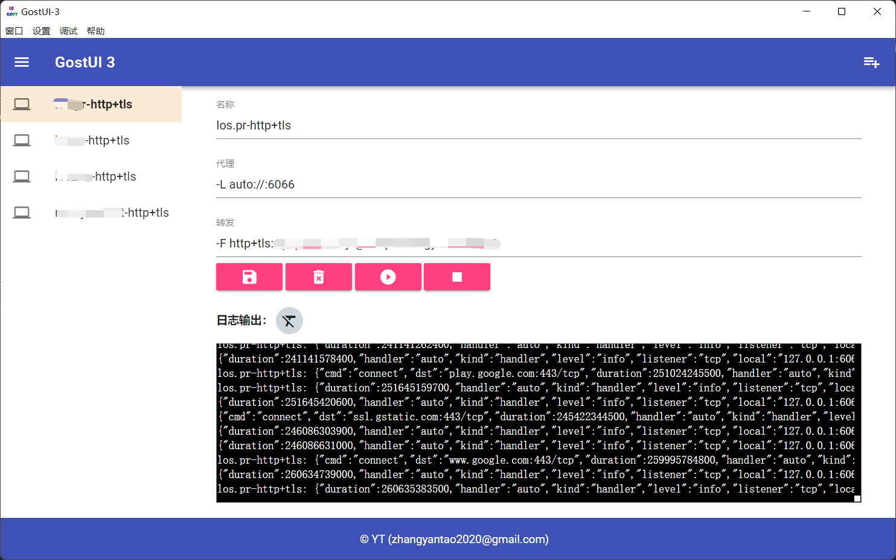

gost-ui-3 是一个封装 [gost](https://github.com/go-gost/gost) 的极简界面应用。只是为了在windows,linux,mac上方便管理，尤其是把它作为客户端的情况下。

之所以称为gost-ui-3，是因为之前也写过一个针对gost2版本的ui，不过应用方式和ui库完全不同。

界面程序是以electron为基础的，再加上集成进了gost的二进制包，所以产品包相对较大。

ui库使用了[mdui](https://github.com/zdhxiong/mdui)

程序包可在release页面下载。

界面示例如下

